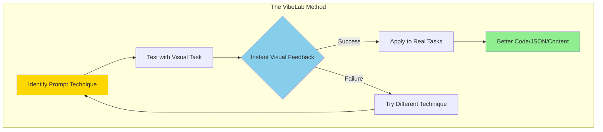
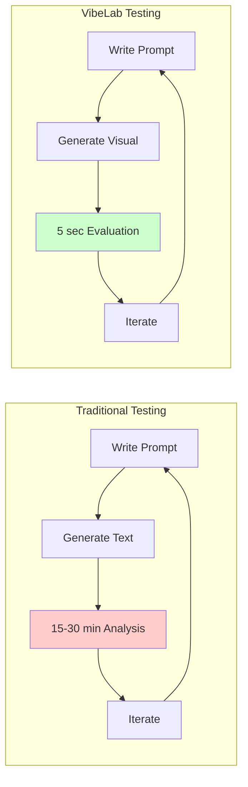

# VibeLab: Visual Testing for Prompt Engineering Excellence

## 🎯 The Vision Behind VibeLab

Imagine you're trying to get an LLM to write Python code, generate complex JSON structures, or follow specific instructions for marketing copy. Traditional testing means writing prompts, generating walls of text, reading through outputs, debugging, and repeating—a process that can take hours.

**VibeLab transforms this tedious cycle into rapid visual experimentation.**

## 💡 The Core Insight

VibeLab uses SVG generation as a "canary in the coal mine" for prompt techniques. While you probably don't need SVGs of ducks, these visual tasks serve as ultra-fast proxies for testing prompting strategies that improve *any* structured output.

### The Key Principle

> **A technique that demonstrably improves output for visual tasks has a strong chance of improving output for other structured tasks you actually care about.**

## 🔄 How It Works



### Example in Action

**Baseline:** "Create an SVG of a pelican on a bicycle"

**Enhanced:** "You are an expert SVG designer who pays attention to detail. Create an SVG of a pelican on a bicycle"

If the enhanced version consistently produces better pelicans, that same enhancement pattern will likely improve your Python code generation, JSON structuring, or marketing copy tasks.

## 🧪 VibeLab Enhanced: The Scientific Framework

### Modern Architecture

- **Backend:** Flask with SQLAlchemy ORM
- **Database:** SQLite with automatic backup
- **Frontend:** Responsive design with real-time updates
- **Analytics:** Statistical significance testing with NumPy/SciPy
- **LLM Integration:** Direct Python API for seamless generation

### Key Features

#### 📊 Advanced Analytics
- Statistical significance testing
- Confidence intervals and effect sizes
- Performance comparison across strategies
- Automated insights and recommendations

#### 🎯 Prompt Strategy Framework
- Modular strategy design
- Pipeline support for chaining strategies
- Custom strategy creation tools
- Strategy templates and sharing

#### 🖥️ Enhanced User Experience
- Carousel evaluation mode
- Side-by-side comparison
- Keyboard shortcuts
- Real-time progress tracking
- Batch operations

## 🚀 Getting Started

### Quick Setup

```bash
# 1. Install dependencies
pip install -r requirements.txt

# 2. Start the application
./start.sh

# 3. Open in browser
http://localhost:8081
```

### Workflow Overview

1. **Create Experiment** → Define base prompts and select strategies
2. **Generate Outputs** → Watch as VibeLab creates visual tests
3. **Evaluate Results** → Rank outputs with drag-and-drop interface
4. **Analyze Performance** → Get statistical insights automatically
5. **Apply Learnings** → Use winning techniques on real tasks

## 📈 Why Visual Testing Works



### The Speed Advantage

- **Text evaluation:** 15-30 minutes of reading and analysis
- **Visual evaluation:** 5 seconds of intuitive assessment
- **Result:** 100x faster iteration cycles

## 🛠️ API Reference

### Core Endpoints

```javascript
// Health check
GET /api/health

// List available models
GET /api/models

// Create experiment
POST /api/experiments
{
  "name": "Expert System Prompts",
  "base_prompts": ["pelican on bicycle"],
  "models": ["claude-3-haiku"],
  "strategies": ["expert_system", "baseline"]
}

// Generate content
POST /api/generate
{
  "experiment_id": 1,
  "prompt": "enhanced prompt text",
  "model": "claude-3-haiku"
}

// Get analysis
GET /api/experiments/{id}/analysis
```

## 🔬 Statistical Rigor

VibeLab Enhanced provides:
- **Wilcoxon signed-rank tests** for paired comparisons
- **Effect size calculations** to measure impact magnitude
- **Confidence intervals** for reliability assessment
- **Automated recommendations** based on statistical evidence

## 🎯 Use Cases

### Direct Applications
- Testing system prompts effectiveness
- Comparing chain-of-thought variations
- Evaluating few-shot example strategies
- Optimizing instruction formatting

### Transferable Insights
- **Code Generation:** Techniques that improve SVG structure transfer to cleaner Python/JavaScript
- **Data Structuring:** Visual organization skills translate to better JSON/XML generation
- **Content Creation:** Attention to detail in images correlates with following content guidelines

## 💭 The Philosophy

VibeLab isn't about making the best SVGs—it's about finding the best prompting patterns quickly. By using visual tasks as rapid feedback mechanisms, we can identify effective techniques in minutes instead of hours, then apply those winning patterns to the complex tasks that truly matter.

## 🤝 Join the Revolution

VibeLab Enhanced is open-source and designed for the AI research community. Whether you're optimizing prompts for production systems or exploring new prompting techniques, VibeLab accelerates your iteration cycles and brings scientific rigor to prompt engineering.

---

*Transform hours of debugging into minutes of visual clarity. Welcome to VibeLab.*
