# VibeLab: Visual Baseline Evaluation Laboratory 🧪

## Visual Testing for Prompt Engineering
### Transform Your Prompt Engineering from Hours to Minutes

VibeLab revolutionizes prompt engineering by using visual tasks as a rapid testing ground for techniques that improve LLM outputs. Instead of spending hours debugging text, get instant visual feedback on what works.

## The Problem We Solve

When you're trying to get an LLM to write Python code, generate complex JSON structures, or follow specific instructions, the traditional workflow is painfully slow:


## The Core Insight

**VibeLab isn't about making the best SVGs. The SVGs are just a super-fast proxy for prompt techniques.**

The bet is simple: a technique that demonstrably improves output for one structured task (like SVG code) has a good chance of improving output for *other* structured tasks you actually care about (like Python code, JSON, or marketing copy).

### How It Works

1. **Identify a technique** you want to test
2. **Test it visually** with simple SVG generation tasks
3. **Compare outputs** instantly - no debugging required
4. **Apply winning techniques** to your actual use cases

### Real Example

```
Baseline: "Create an SVG of a pelican on a bicycle"
Enhanced: "You are an expert SVG designer who pays attention to detail. 
          Create an SVG of a pelican on a bicycle"
```

If the enhanced version consistently produces better pelicans, that same enhancement pattern will likely improve your Python code generation, JSON structuring, or marketing copy tasks.

## The VibeLab Platform

### Features

- **Experiment Setup**: Configure base prompts, models, and prompt variations
- **Queue Management**: Batch generation with progress tracking, pause/resume functionality
- **Visual Evaluation**: Drag-and-drop ranking interface for human quality assessment
- **Results Analysis**: Comprehensive results table with quality scoring
- **Data Export**: Export results to JSONL format for further analysis

### Prompt Variations We Test

1. **Baseline**: No few-shot examples, chain-of-thought or role-play
2... Todo: 

## Why This Works

```mermaid
graph TB
    A[Goal: Better LLM Outputs] --> B[Challenge: Slow Testing]
    B --> C[Solution: Visual Proxy Tasks]
    C --> D[Quick SVG Tests]
    D --> E1[Technique A Works ✓]
    D --> E2[Technique B Fails ✗]
    E1 --> F[Apply to Real Tasks]
    F --> G1[Better Python Code]
    F --> G2[Better JSON Structure]
    F --> G3[Better Marketing Copy]
    
    style A fill:#ffd700
    style C fill:#87ceeb
    style E1 fill:#90ee90
    style E2 fill:#ff6b6b
```



## Getting Started

1. **Setup**: Define your base prompts (e.g., "SVG of a pelican riding a bicycle")
2. **Configure**: Select models and prompt/system prompt variations to test
3. **Generate**: Run the generation queue to create SVGs in random order
4. **Evaluate**: Use drag-and-drop to rank SVG quality
5. **Analyze**: Review results
6. **Apply**: Use winning techniques on your real tasks

## Technical Implementation

- **Frontend**: HTML/CSS/JavaScript single-page application
- **LLM Integration**: Uses `llm` python library from simonw for interacting with LLM.
- **Storage**: This should save data automatically to make it always available between sessions.
- **Models Supported**: any model installed in LLM tool

## The Bottom Line

VibeLab transforms prompt engineering from a tedious, hours-long process into a rapid, visual experiment. It's about quickly identifying *patterns* in prompt structures that work, using images as a quick, cheap visual shortcut for evaluation, so you can apply those winning patterns to the tasks that actually matter to you.

---

**Remember**: The SVGs are just the testing ground. The real value is in discovering prompt techniques that improve all your LLM outputs.
