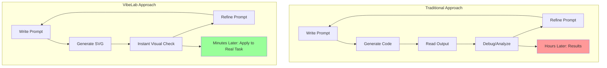
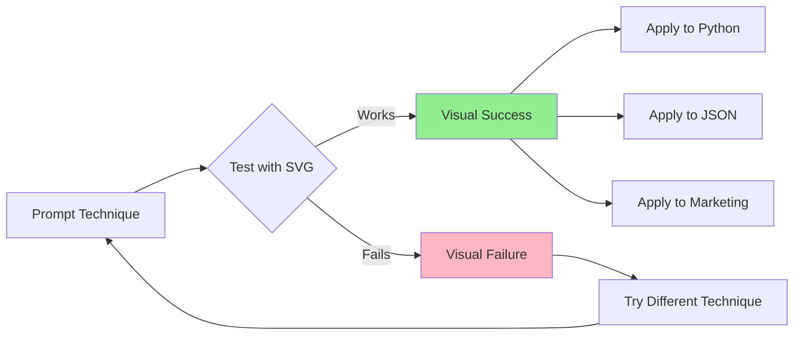
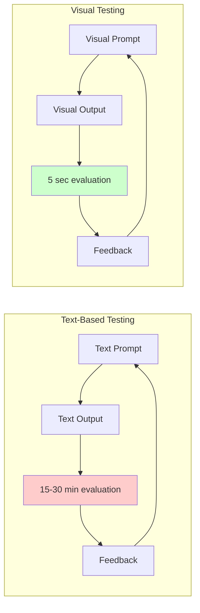
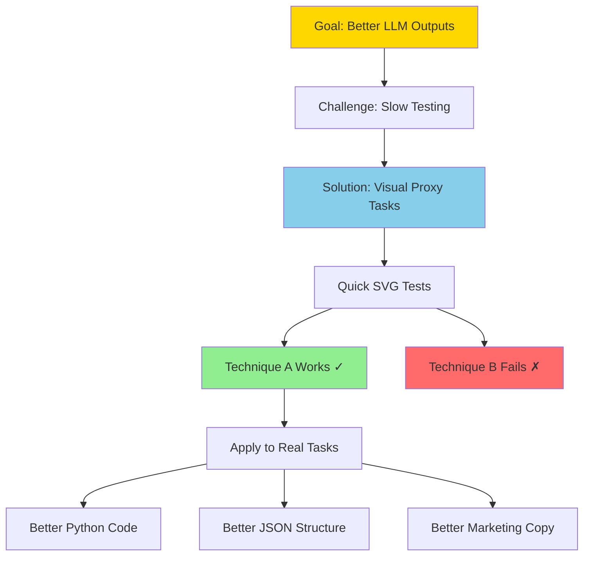

# VibeLab: Visual Testing for Prompt Engineering

## The Core Concept

VibeLab uses visual tasks as a rapid testing ground for prompt engineering techniques. Instead of spending hours debugging text outputs, you can instantly see if a prompting strategy works by testing it on image generation tasks first.

## Why This Works

### The Problem
- Testing prompt techniques on complex tasks (Python code, JSON structures) is time-consuming
- Reading and evaluating text outputs takes significant effort
- Iteration cycles are slow and tedious

### The Solution
- Use simple visual tasks (SVG generation) as a "canary in the coal mine"
- Visual outputs provide instant, intuitive feedback
- Techniques that improve visual outputs often improve structured text outputs

## How It Works

1. **Identify a technique** you want to test (e.g., detailed system prompts, chain-of-thought or role-playing prompts)
2. **Test it visually** with simple SVG generation tasks
3. **Compare outputs** instantly - no debugging required
4. **Apply winning techniques** to your actual use cases

### Example

**Baseline prompt:** "Create an SVG of a pelican on a bicycle"

**Enhanced prompt:** "You are an expert SVG designer who pays attention to detail. Create an SVG of a pelican on a bicycle"

If the enhanced version consistently produces better pelicans, that same enhancement pattern will likely improve your Python code generation, JSON structuring, or marketing copy tasks.

## Visual Representation Options

### Chart 1: Traditional vs VibeLab Workflow

### Chart 2: Technique Transfer Flow

### Chart 3: Feedback Loop Comparison

### Chart 4: Concept Hierarchy

